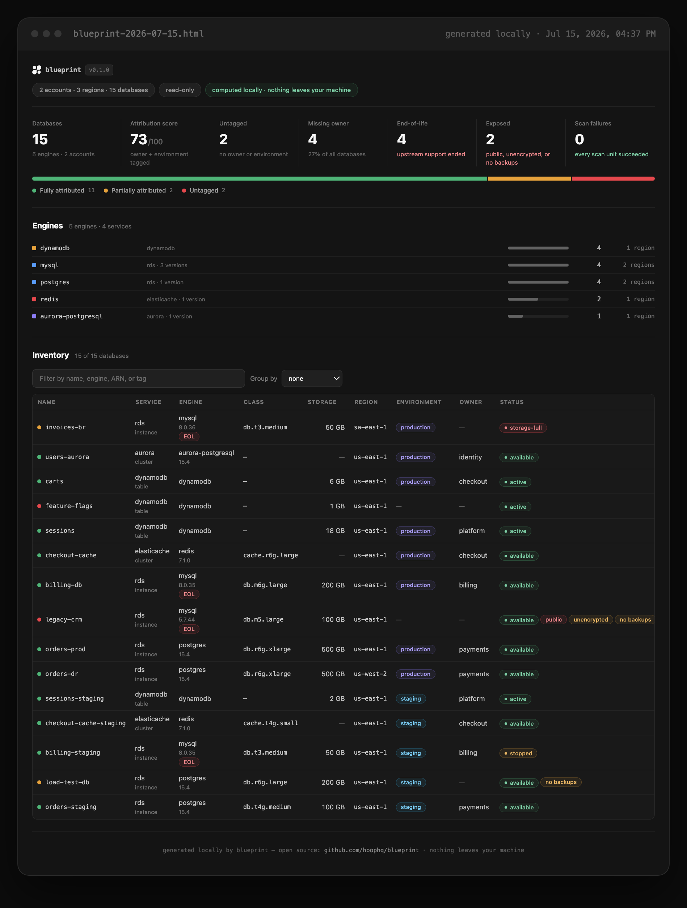

<div align="center">

# 📐 blueprint

### What databases are you actually running?

`blueprint` is a read-only census of every managed database reachable from
your AWS credentials — RDS, Aurora, DocumentDB, Neptune, DynamoDB,
ElastiCache, Redshift — **entirely from your machine**.

Runs locally &nbsp;·&nbsp; Stays local &nbsp;·&nbsp; Read-only

[](https://github.com/hoophq/blueprint/releases/latest)
[](https://github.com/hoophq/blueprint/actions/workflows/ci.yml)
[](LICENSE)



</div>

Past a few hundred resources, nobody has ground truth on their databases anymore: instances accumulate across regions, accounts, and teams faster than any spreadsheet or wiki page keeps up. blueprint runs locally, calls only AWS APIs, and writes its output (terminal summary, HTML report, JSON, CSV) to your local disk. Nothing leaves your machine.

## Quickstart

Homebrew (macOS & Linux):

```sh
brew install hoophq/tap/blueprint
```

Install script (macOS & Linux; verifies the release checksum, installs to `/usr/local/bin` or `~/.local/bin`):

```sh
curl -fsSL https://raw.githubusercontent.com/hoophq/blueprint/main/install.sh | sh
```

From source (Go 1.26+):

```sh
go install github.com/hoophq/blueprint@latest
```

Then, with AWS credentials available (env vars, `~/.aws` profile, SSO — the standard chain):

```sh
blueprint scan
```

No credentials handy? See what the output looks like with built-in fixture data:

```sh
blueprint scan --demo
```

## Usage

```sh
blueprint scan                          # scan all enabled regions of the current account
blueprint scan --profile prod           # use a specific AWS shared-config profile
blueprint scan --regions us-east-1,eu-west-1
blueprint scan --org                    # scan all AWS Organizations member accounts
blueprint scan --org --role-name blueprint-readonly
blueprint scan --formats html,json,csv  # choose outputs (default: html,json)
blueprint scan --out ./reports          # directory for output files (default: .)
blueprint scan --no-open                # don't open the HTML report in the browser
blueprint scan --compare last.json      # diff against a specific census JSON instead of history
blueprint scan --fail-on-change         # non-zero exit when the diff finds differences
blueprint scan --no-history             # don't archive this scan or auto-diff
blueprint scan --demo                   # render from fixture data, no AWS calls
```

## History

Every scan is archived locally under `~/.blueprint/history/` (override with
`BLUEPRINT_HISTORY_DIR`), and the next scan of the same scope automatically
shows what changed:

```
━━ changes vs last scan (Jun 12, 2026 · 33 days ago) ━━
  +2 new  ·  −1 removed  ·  ~1 changed
  + reporting-replica (rds postgres, us-east-1)
  ~ orders-prod (rds, us-east-1): engine_version 13.13 → 15.4
```

Scans are bucketed by scope (accounts + regions), so scanning a different
account or region set never diffs against the wrong baseline. Each scope
keeps its last 30 censuses; history lives on your disk and nowhere else.

## What gets scanned

- RDS (all engines)
- Aurora (MySQL and PostgreSQL clusters)
- DocumentDB
- Neptune
- DynamoDB
- ElastiCache (Redis, Valkey, Memcached)
- Redshift, including Redshift Serverless

Every resource is normalized into one model: engine, version, instance class, storage, endpoint host, status, region, account, creation time, tags. Environment and owner are taken from tags only — imported, never inferred.

## Outputs

- **Terminal**: a sprawl summary — total databases, distinct engines/regions/accounts, a per-service breakdown, and counts of resources with no owner or environment tag.
- **HTML**: a single self-contained file (`blueprint-YYYY-MM-DD.html`) you can open in a browser or attach to a doc. No external assets, no CDN calls.
- **JSON**: the complete snapshot (`blueprint-YYYY-MM-DD.json`) — every resource, plus the failure ledger.
- **CSV**: one row per resource (`blueprint-YYYY-MM-DD.csv`) for spreadsheets.

## Required IAM permissions

blueprint needs read-only describe/list permissions. The minimal policy ([docs/iam-policy.json](docs/iam-policy.json)):

```json
{
  "Version": "2012-10-17",
  "Statement": [
    {
      "Sid": "BlueprintReadOnly",
      "Effect": "Allow",
      "Action": [
        "rds:Describe*",
        "dynamodb:ListTables",
        "dynamodb:DescribeTable",
        "dynamodb:ListTagsOfResource",
        "elasticache:Describe*",
        "elasticache:ListTagsForResource",
        "redshift:Describe*",
        "redshift-serverless:List*",
        "ec2:DescribeRegions",
        "sts:GetCallerIdentity"
      ],
      "Resource": "*"
    }
  ]
}
```

The AWS managed policies `ReadOnlyAccess` or `SecurityAudit` also cover everything blueprint calls, if you already have one of those attached.

### Org mode

`blueprint scan --org` enumerates all ACTIVE accounts in your AWS Organization and scans each one by assuming a role in it.

Requirements:

- Run it with credentials from the organization's **management account** or a **delegated administrator** account, with `organizations:ListAccounts` allowed.
- A role with the read-only policy above must exist in **every member account**, and its trust policy must allow the calling account to assume it. The default role name is `OrganizationAccountAccessRole` (created automatically for accounts made through Organizations); override with `--role-name`.
- The caller additionally needs `organizations:ListAccounts` and `sts:AssumeRole` on the member-account roles — see [docs/iam-policy-org.json](docs/iam-policy-org.json), replacing `${RoleName}` with your actual role name.

Accounts where the role is missing or untrusting do not abort the scan: they show up as failures in the ledger, and everything else is still scanned.

## Zero telemetry

blueprint phones home to no one. No usage analytics, no crash reporting, no update checks, not even anonymous pings. The only network calls it makes are to AWS APIs, using the credentials you provide. Output files are written to your local disk and go nowhere unless you send them somewhere.

## License

MIT © [hoop.dev](https://hoop.dev) — built by the team behind [hoop](https://github.com/hoophq/hoop). See [LICENSE](LICENSE).
